# Kubernetes Multi-Tenancy Ingress Setup - Deploying AWS Load Balancer Controller on Amazon EKS with Fargate

Deploying applications on Amazon EKS Fargate provides a truly serverless Kubernetes experience — eliminating the need to manage EC2 worker nodes, perform OS patching, or handle infrastructure scaling.

This guide demonstrates how to set up this architecture in a cost-efficient and production-ready manner by integrating ingress capabilities for controlled external access and traffic management.

You will walk through the complete process of provisioning an EKS Fargate cluster, configuring the AWS Load Balancer Controller using IAM Roles for Service Accounts (IRSA) for secure, least-privilege access, and deploying two real-world applications behind a shared Application Load Balancer (ALB) using path-based routing.

By the end, you will have a scalable, resilient, and operationally simplified Kubernetes deployment pattern suitable for modern cloud-native workloads.

## Tools:

-	Container Orchestration - **Kubernetes**
-	Ingress Controller - **AWS Load Balancer Controller**
-	Serverless Architechture - **AWS Fargate**
-   Kubernetes Package Manager - **Helm**


## GitHub Repository:

**https://github.com/ucheor/Kubernetes_EKS_Fargate_Ingress_QR.git**

---

## Architecture Overview:

Before diving in, here is what we are building:

-	An EKS cluster (ingress-demo-cluster) in us-east-1, running entirely on Fargate
-	Three Fargate profiles: fp-default (default + kube-system), focus-app-profile, world-clock-profile
-	Two applications in isolated namespaces: world-clock and focus-app
-	A single shared ALB routing traffic by URL path: /clock/ and /focus/
-	The AWS Load Balancer Controller running in kube-system, managing ALB lifecycle

A key architectural decision in this design is implementing path-based routing across multiple namespaces using a single Application Load Balancer (ALB).

Provisioning a dedicated ALB for every service or namespace can quickly become inefficient and expensive. Instead, by leveraging shared ingress patterns such as an IngressGroup or coordinated Ingress resources, applications running in different namespaces can utilize the same load balancer while maintaining clear and isolated routing rules.

With this approach, each application is exposed through distinct URL paths, allowing the ALB to forward traffic to the correct backend service based on the request path. This not only reduces infrastructure cost but also simplifies load balancer management and promotes a scalable, multi-tenant cluster design.

Such shared ingress architectures are widely adopted in production Kubernetes environments because they strike the right balance between cost optimization, operational simplicity, and traffic isolation.

---

## Step 1: Create the EKS Fargate Cluster

We will be provisioning this cluster through the aws cli allowing eksctl to handle a significant amount of infrastructure creation under the hood: it creates a CloudFormation stack, provisions a VPC with public and private subnets across two availability zones, configures the EKS control plane, and sets up the default Fargate profile. 

```
eksctl create cluster \
  --name ingress-demo-cluster \
  --region us-east-1 \
  --fargate
```

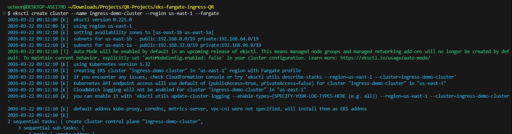

It took about 15 minutes for the cluster to be ready so be ready to give it some time. In the AWS Console, navigate to Amazon EKS > Clusters > ingress-demo-cluster. 

---

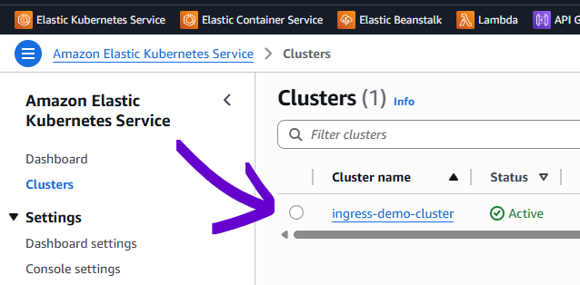

---

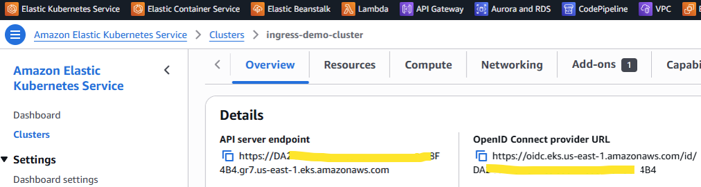

---

**Important:**

The **Overview** tab for the ingress-demo-cluster displays the OpenID Connect (OIDC) provider URL which we will need in the coming steps to verify provider registration. The **Networking** tab reveals the VPC ID that was automatically created by eksctl. You will need this VPC ID when installing the AWS Load Balancer Controller via Helm in an upcoming step. The **Compute** tab confirms the design intent: zero managed node groups. All compute is handled by Fargate. Note the current Fargate profiles - **default** and **kube-system**.

---

## Verify the Cluster
Verify the cluster is ready and that Fargate nodes have registered. Note that the Fargate nodes are AWS managed nodes which are different from EC2 instances. You do not have access to manage node configuration and updates on Fargate since they are managed by AWS.

```
kubectl get nodes
```
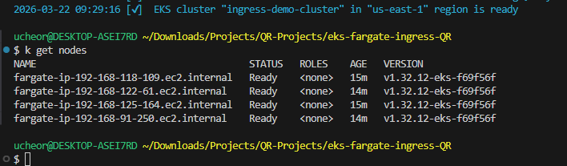

---

## Step 2: Associate the IAM OIDC Provider

IRSA (IAM Roles for Service Accounts) lets Kubernetes Pods use AWS permissions securely without storing access keys.

It works by linking your Amazon EKS cluster’s identity system (OIDC) with AWS IAM so AWS can trust and verify which Pod is making a request. This step is required for tools like the AWS Load Balancer Controller because they need permission to create and manage load balancers.

Even though the cluster has an OIDC URL, AWS doesn’t trust it automatically. Running the associate command below tells AWS: “You can trust Pods from this cluster and allow them to use IAM roles.” Without this, Pods can’t get AWS permissions in a safe way.

```
eksctl utils associate-iam-oidc-provider \
    --region us-east-1 \
    --cluster ingress-demo-cluster \
    --approve
```

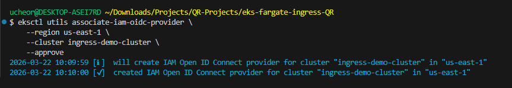

This registers the OIDC provider in AWS IAM and we can verify using the command below

```
aws iam list-open-id-connect-providers | grep <your-cluster-oidc-id> #looks like D3472KDFK74873684JDBS732
```

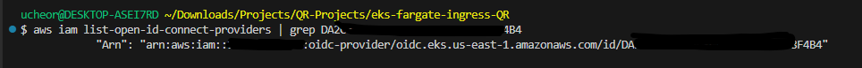

---

## Step 3: Create IAM Policy for the Load Balancer Controller Pods (Alternative Below)

The AWS Load Balancer Controller needs a broad set of AWS API permissions to manage ALBs, Target Groups, Security Groups, WAF associations, and Shield protections. 

In this step, we are creating an IAM policy that includes the permissions we need for our AWS Load Balancer Controller to work optimally. Rather than crafting this policy manually, the Load Balancer Controller project publishes a maintained policy document that makes it easy to figure out what permissions we need. We can create the **AWSLoadBalancerControllerIAMPolicy** using the iam_policy.json file in the repository.

```
aws iam create-policy \
  --policy-name AWSLoadBalancerControllerIAMPolicy \
  --policy-document file://iam_policy.json
```

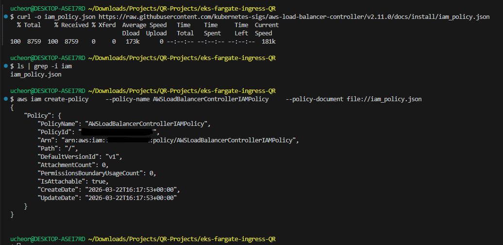


**Alternatively,** to download a new copy of iam_policy.json and create a policy using your new copy. You might have to review permissions to ensure Allow is enabled on "elasticloadbalancing:SetRulePriorities". Remember you can add any additionally required permission to the policy through the AWS IAM console if required.

```
curl -o iam_policy.json \
  https://raw.githubusercontent.com/kubernetes-sigs/aws-load-balancer-controller\
  /v2.11.0/docs/install/iam_policy.json
```
```
aws iam create-policy \
  --policy-name AWSLoadBalancerControllerIAMPolicy \
  --policy-document file://iam_policy.json
```

**Security best practice:** Never embed AWS credentials in your pods. IRSA + this scoped IAM policy means the Load Balancer Controller only has the permissions it needs, bound to the specific service account token.

---

## Step 4: Create the IAM Service Account and Attach Policy

In this step, we will create a new service account "aws-load-balancer-controller" and attach the policy we created above to it using a role. This service account is deployed into the kube-system namespace where it will be used by the AWS Load Balancer pods when they are created. Remember to update the command below with your AWS Account ID. 

```
eksctl create iamserviceaccount \
  --cluster=ingress-demo-cluster \
  --namespace=kube-system \
  --name=aws-load-balancer-controller \
  --role-name AmazonEKSLoadBalancerControllerRole \
  --attach-policy-arn=arn:aws:iam::<ACCOUNT_ID>:policy/AWSLoadBalancerControllerIAMPolicy \         # remember to update with your AWS account ID
  --approve
```
The resulting IAM role has a trust policy that says: 'Allow the Kubernetes service account aws-load-balancer-controller in the kube-system namespace of cluster ingress-demo-cluster to assume this role.' This is the IRSA binding in action.

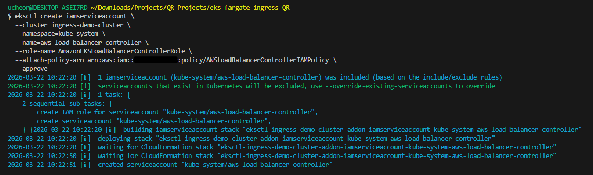

---

## Step 5: Install the AWS Load Balancer Controller via Helm

Helm is the standard Kubernetes package manager. The AWS Load Balancer Controller is published as a Helm chart in the eks chart repository, which handles CRD installation, RBAC configuration, Deployment creation, and all supporting resources in one command. We will be installing it using Helm. 

Note that we will be applying the service account we created above to the load balancer controller created in this step. 

```
helm repo add eks https://aws.github.io/eks-charts
helm repo update
```
We will need your cluster VPC for the next command. Feel free to grab it from your cluster dashboard - under Networking. Alternatively, you can get using aws cli

```
aws eks describe-cluster \
  --name ingress-demo-cluster \
  --query "cluster.resourcesVpcConfig.vpcId" \
  --output text
```
---

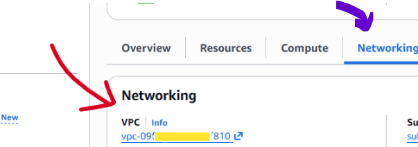

---

```
helm install aws-load-balancer-controller eks/aws-load-balancer-controller \
  -n kube-system \
  --set clusterName=ingress-demo-cluster \
  --set serviceAccount.create=false \
  --set serviceAccount.name=aws-load-balancer-controller \
  --set region=us-east-1 \
  --set vpcId=<vpc-09fxxdjjxxxdhh810>           # update with your cluster VPC
```

Key flags explained:
-	serviceAccount.create=false — we already created the SA with IRSA in Step 5, so Helm must not overwrite it
-	serviceAccount.name=aws-load-balancer-controller — must match exactly what eksctl created
-	vpcId — tells the LBC which VPC to manage ALBs in (retrieved from the Networking tab in Step 2)

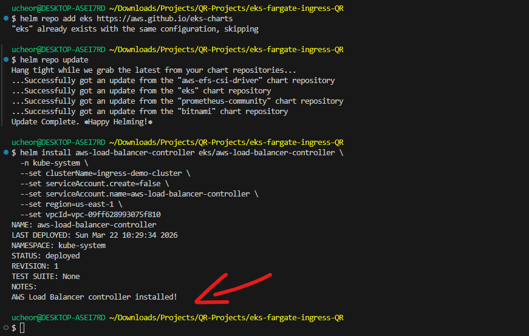

Let's go ahead and make sure the AWS Load Balancer Controller pods are running and deployment is successful.

```
kubectl get deployment -n kube-system aws-load-balancer-controller
kubectl get pods -n kube-system
```
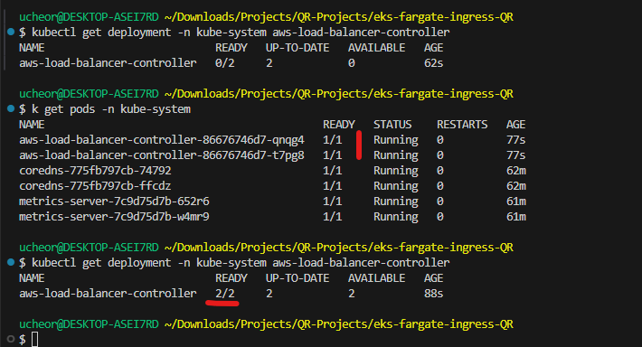

---

## Step 6: Create Fargate Profiles for Application Namespaces

**Fargate Profile — Namespace Binding**: In EKS Fargate, pods only run on Fargate if they match a Fargate profile. Profiles are bound to namespaces (and optionally label selectors). Since our applications will live in world-clock and focus-app namespaces, we need profiles for each.

```
eksctl create fargateprofile \
  --cluster ingress-demo-cluster \
  --name focus-app-profile \
  --namespace focus-app
```

```
eksctl create fargateprofile \
  --cluster ingress-demo-cluster \
  --name world-clock-profile \
  --namespace world-clock
```

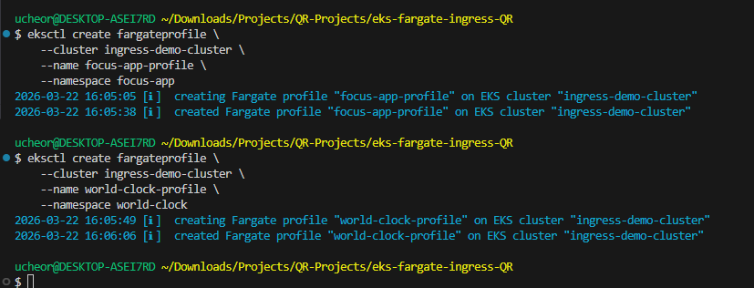

---
In the AWS Console, navigate to Amazon EKS > Clusters > ingress-demo-cluster. The **Compute** tab should show the Fargate profiles as created. 

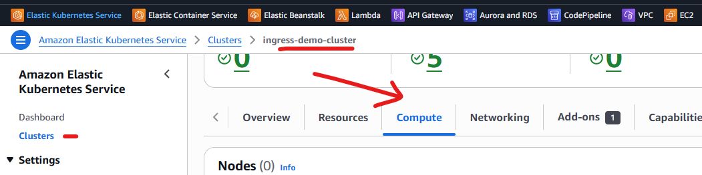

---

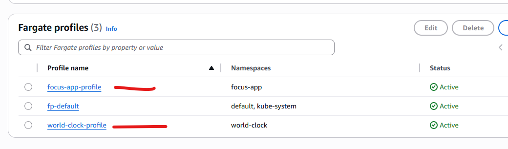

```
eksctl get fargateprofile --cluster ingress-demo-cluster
```

We can now create our cluster namespaces and deploy our applications in the appropriate namespaces.

---

## Step 7: Create Namespaces and Deploy Applications, Services and Ingress

Namespaces are the primary isolation boundary in Kubernetes. By placing each application in its own namespace, you can enable independent RBAC, resource quotas, and network policies. 

```
kubectl apply -f namespace.yaml
```
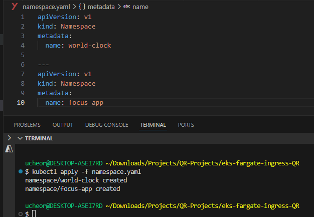

In this project, we need three Kubernetes resources for each application:

-	Deployment — manages pod replicas, rolling updates, and restart policies
-	Service — provides stable DNS and load balancing across pod replicas (ClusterIP type, since the ALB handles external traffic)
-	Ingress — declares the routing rules; the Load Balancer Controller watches these and creates/updates ALB listener rules accordingly

Apply all six manifests:

```
kubectl apply -f clock-deployment.yaml
kubectl apply -f clock-service.yaml
kubectl apply -f clock-ingress.yaml
kubectl apply -f focus-deployment.yaml
kubectl apply -f focus-service.yaml
kubectl apply -f focus-ingress.yaml
```

**Ingress Annotation Tip**: Your Ingress resources must include kubernetes.io/ingress.class: alb (or use ingressClassName: alb) and alb.ingress.kubernetes.io/target-type: ip. On Fargate, IP target type is required because there are no node-level ports to use with instance target type.

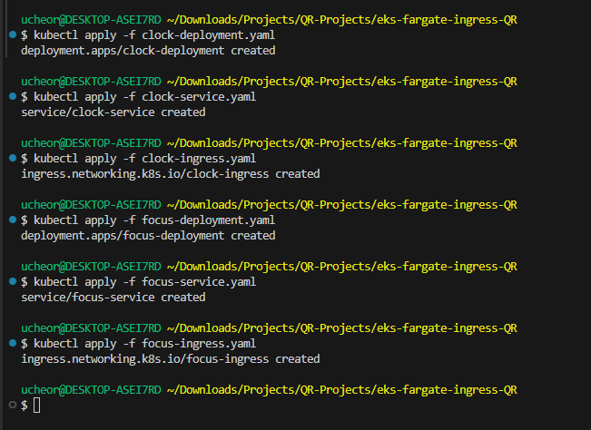

---

## Step 8: Verify Pods and Ingress

**Confirming All Pods are Running**: Confirm all application pods are running to confirm a healthy deployment. 

```
kubectl get pods -A
```
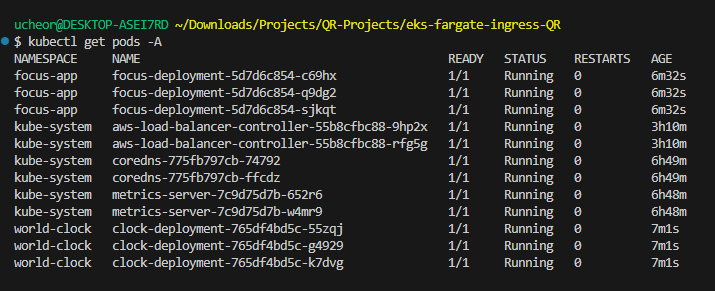


**Verifying the ALB Address**
Check that the Ingress resources have been assigned an ALB address. The AWS Load Balancer Controller calls the AWS API to provision the ALB, which takes 1-3 minutes. If it is provisioned correctly, you should have a shared load balancer address for both ingress.

```
kubectl get ingress -A
```

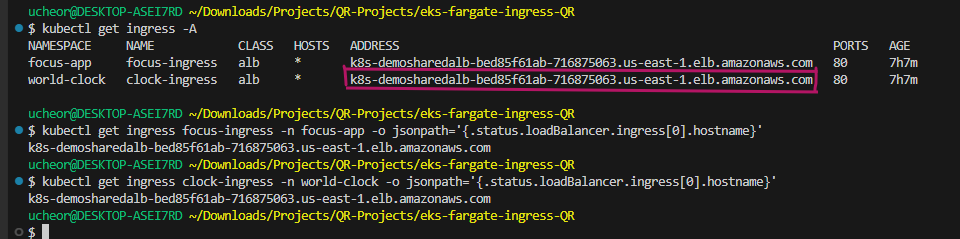

---

## Step 9: Access the Applications

Both applications should be accessible at different paths under the same ALB — exactly the architecture we designed. The AWS Load Balancer Controller has successfully translated two Kubernetes Ingress resources into a single ALB with path-based routing rules. For these applications, the source code is on /clock and /focus paths to make it easier to demonstrate path based routing. 

An alternative use case with ingress is host based routing which might give more options for stronger isolation, independent TLS and security policy control, and better alignment with team ownership boundaries.

**Get the Application Load Balancer Address - ALB-DNS**

```
kubectl get ingress focus-ingress -n focus-app -o jsonpath='{.status.loadBalancer.ingress[0].hostname}'
```

**World Clock App**

Navigate to the ALB hostname with the /clock/ path:

http://ALB-DNS/clock/           # **replace ALB-DNS with the ALB DNS address from the ingress - http**

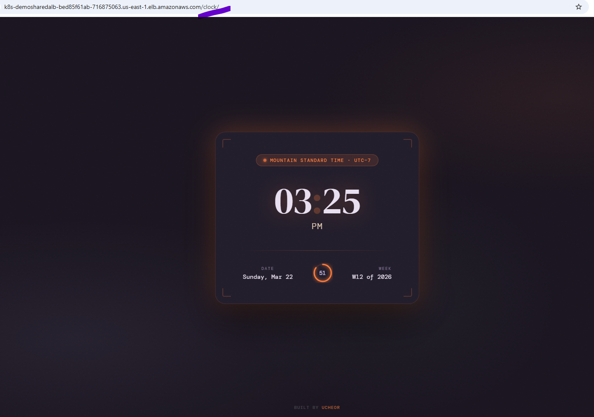

---

**Focus Timer App**

Navigate to the ALB hostname with the /focus/ path:

http://ALB-DNS/focus/           # **replace ALB-DNS with the ALB DNS address from the ingress - http**

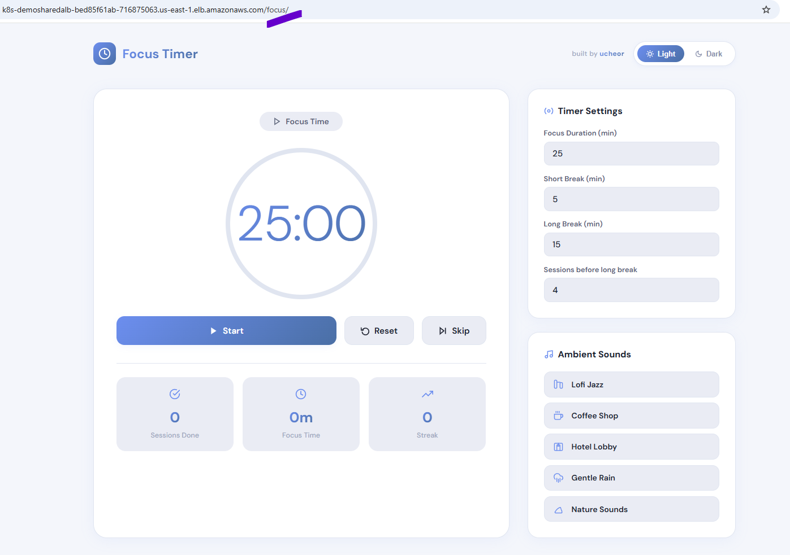

---

**If you made it to this point, CONGRATULATIONS!! and THANK YOU!! for sticking with me.**

---

## Step 10: Clean Up

Time to clean up provisioned resources. Eksctl cluster delete tears down everything it originally created — the CloudFormation stack, VPC, subnets, Fargate profiles, and the EKS control plane. It does not touch resources created outside of CloudFormation, so you should manually clean up first:

1. Delete your Ingress resources first (removes the ALBs from AWS)
```
kubectl delete ingress --all -A
```
Wait until kubectl get ingress -A shows nothing — the Load Balancer Controller needs time to call the AWS API and delete the ALBs. If you skip this, the ALBs orphan in your account and keep billing.

2. Then delete the cluster
```
eksctl delete cluster \
  --name ingress-demo-cluster \
  --region us-east-1
```

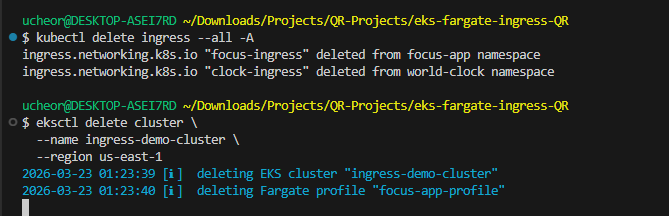

This takes about 10–15 minutes. You can watch CloudFormation in the AWS Console or add --wait (it waits by default). If it gets stuck, check the CloudFormation console for failed stack events — usually a VPC dependency that didn't clean up because of the orphaned ALB security groups.

3. Verify in AWS Console that these are gone:

- EKS cluster
- CloudFormation stacks (search eksctl-ingress-demo-cluster)
- EC2 > Load Balancers (the ALB)
- VPC (the one eksctl created)
- IAM roles prefixed with eksctl-ingress-demo-cluster


---

## Common Pitfalls & How to Avoid Them

1. Ingress not getting an ALB address
-	Check Load Balancer Controller pod logs: kubectl logs -n kube-system -l app.kubernetes.io/name=aws-load-balancer-controller
-	Verify the Ingress has annotation kubernetes.io/ingress.class: alb
-	Confirm IRSA is correctly set up — Load Balancer Controller needs AWS API access to create ALBs. Check logs to see if there any missing policy permissions.

2. Pods stuck in Pending on Fargate
-	No matching Fargate profile for the namespace — create one with eksctl create fargateprofile
-	Check pod events: kubectl describe pod <name> -n <namespace>

3. Instance target type error
-	Fargate requires alb.ingress.kubernetes.io/target-type: ip
-	Instance target type requires node-level ports, which Fargate does not expose

4. Path routing issues
-	If you are using your own application, note that the application has to be accessible in the path you specify on your ingress rules

---

# Conclusion

This step by step shows multi-tenancy Kubernetes deployments on AWS EKS Fargate behind a single Application Load Balancer using the AWS Load Balancer Controller. This demosntration shows Kubernetes Ingress in a serverless EKS environment on AWS. The critical dependency chain is: OIDC association enables IRSA, IRSA gives the Load Balancer Controller IAM access, and the Load Balancer Controller translates Ingress resources into real AWS ALBs.

The full setup covered:

→ EKS Fargate cluster with eksctl (zero EC2 nodes)
→ OIDC association + IRSA so the controller can call AWS APIs securely — no static credentials
→ IAM policy + service account wired together via CloudFormation
→ AWS Load Balancer Controller installed via Helm
→ Fargate profiles per namespace (world-clock + focus-app)
→ Path-based routing on a shared ALB: /clock/ and /focus/ on one DNS name, one cost

The pattern demonstrated here — a shared ALB with path-based routing serving multiple namespaced applications — is directly applicable to production multi-tenant environments. It minimizes ALB costs, simplifies DNS management, and keeps Kubernetes-native tooling (kubectl, Helm) as the control plane for your infrastructure.

#Kubernetes #AWS #EKS #Fargate #DevOps #CloudNative #Helm #IRSA #InfrastructureAsCode

---

*If this guide helped you, feel free to connect or share. Also reach out if you have any insight on how I can improve this project in the future. What has been your experience setting up Ingress Controllers and managing Ingress.*
